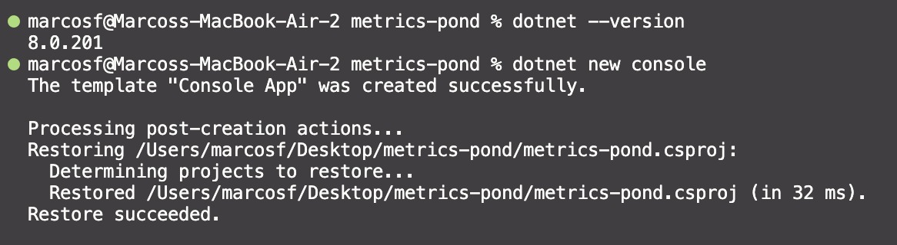
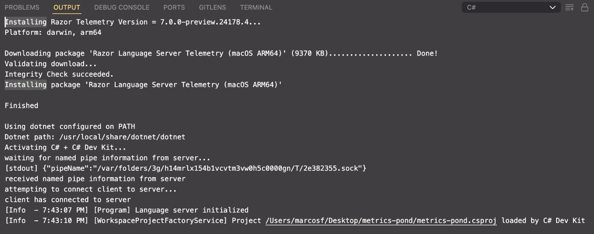
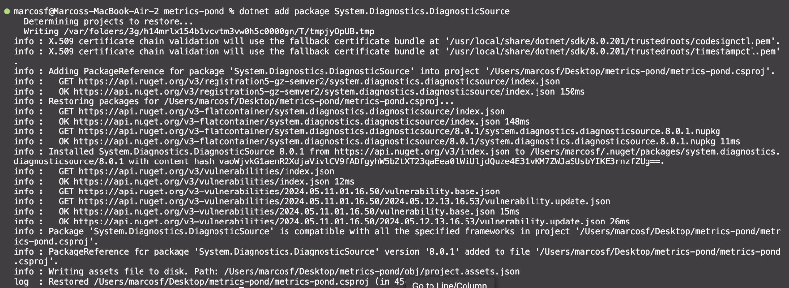
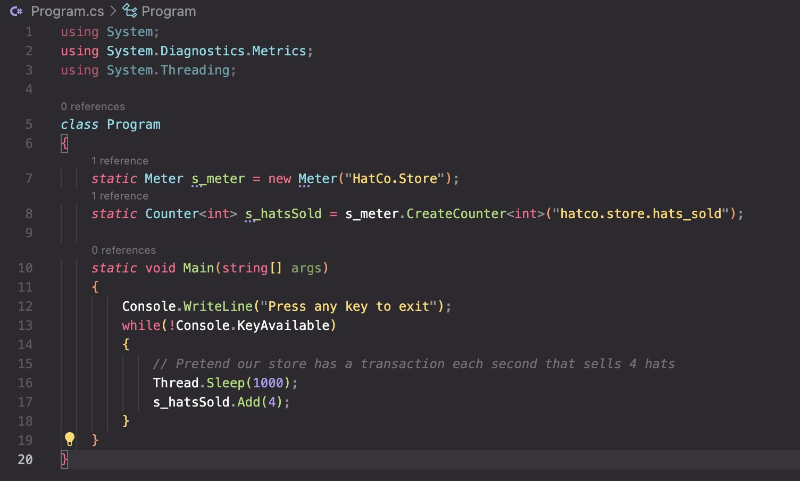
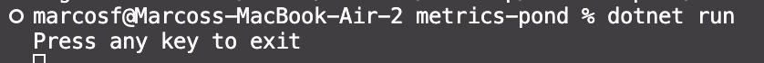
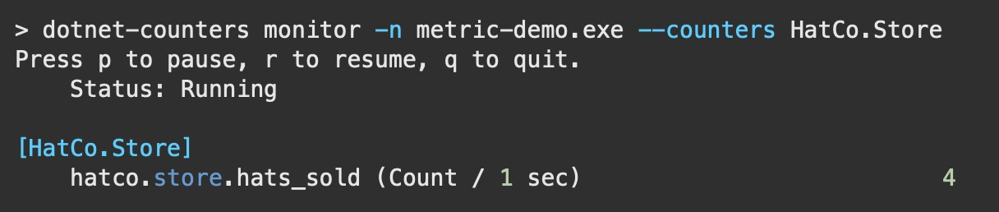
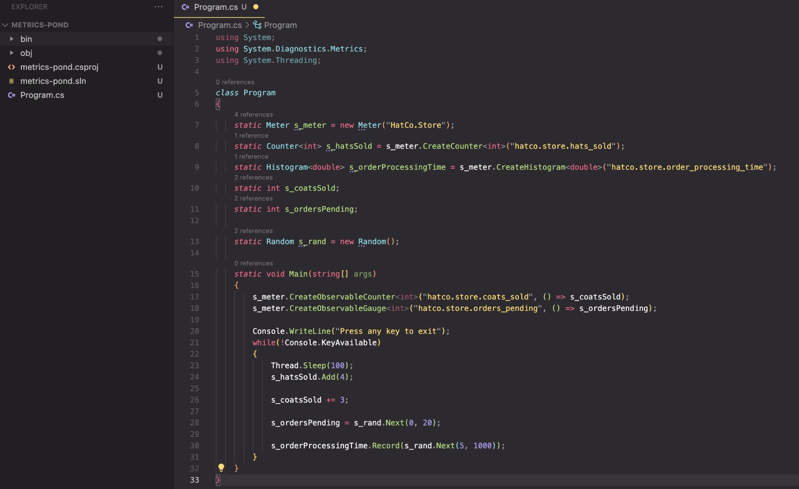
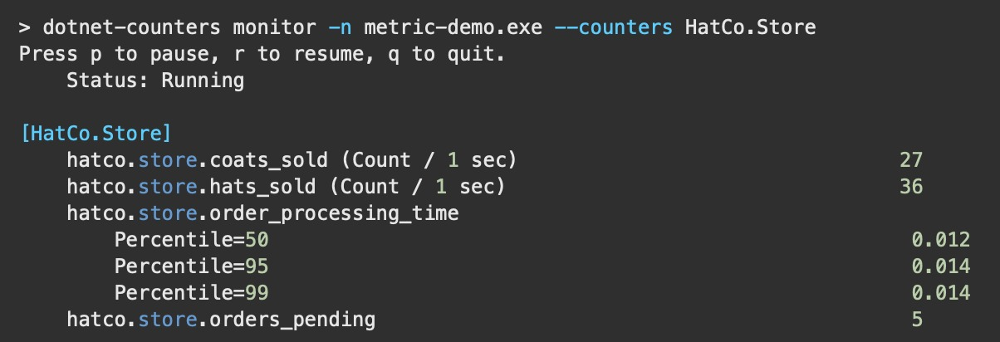

## Criar uma métrica personalizada

Para a realização do primeiro exemplo, o tutorial pede que se crie um novo aplicativo de console que faça referência ao pacote NuGet System.Diagnostics.DiagnosticSource.

Para tanto, foi criado um novo projeto de console chamado CustomMetrics. Esse projeto foi criado com o comando `dotnet new console`.

Os prompts de instalação do pacote NuGet System.Diagnostics.DiagnosticSource foram seguidos e o pacote foi instalado com sucesso, como se observa na imagem abaixo.

Uma vez instalado o pacote, a classe Program foi modificada para que se pudesse criar um medidor personalizado, conforme indicado no tutorial. O código da classe Program foi modificado conforme abaixo.

E após a refatoração, a aplicação foi executada, por meio do comando `dotnet run`, e o resultado foi o esperado, conforme a imagem abaixo.

Instanciada e compilada a aplicação, o próximo passo foi a criaçãofafdsfsdfsddf de um medidor personalizado. Para tanto, foi executado o comando do `dotnet-counters` para listar os medidores disponíveis.

Embora não seja exigido no exercício, o código foi atualizado de acordo com o terceiro passo do tutorial, conforme abaixo, resultando em métricas de maior complexidade.

## Obtenha um Medidor por meio da injeção de dependência

No exemplo previamente apresentado, o Medidor foi obtido construindo-o com new e atribuindo-o a um campo estático.

Para utilizar o medidor por meio de injenção de dependência, é necessário criar um objeto Medidor usando IMeterFactory. A partir do .NET 8, os hosts registrarão automaticamente IMeterFactory no serviço de contêiner ou você poderá registrar manualmente o tipo em qualquer IServiceCollection chamando AddMetrics.

Seguindo os mesmos passos, foi criado um novo projeto de console chamado `di-metrics`. Esse projeto foi criado com o comando `dotnet new console`. O código pode ser obtido em [di-metrics/Program.cs](di-metrics/Program.cs).
